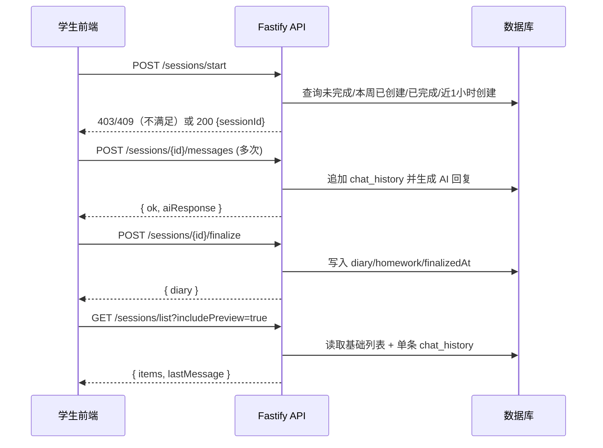
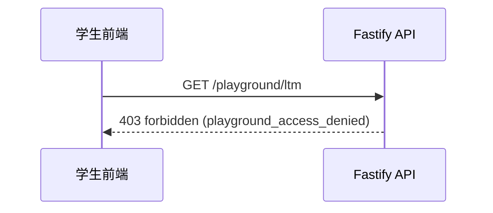

## 会话与记忆 API（生产用）

说明：以下接口均为后端 Fastify 暴露，默认地址 `http://localhost:3000`。所有时间均为服务器时间，所有文本字段均为 UTF-8。

统一约定
- 身份字段：`visitorInstanceId` 标识一个来访者实例；`sessionId` 标识一次具体会话。
- 聊天消息：前端/后端统一使用 `speaker ∈ {"user","ai"}` 与 `content: string`。
- Chat History 标准化：后台会将结构化数组转换为文本 `"ai: ..."/"user: ..."` 以喂给 LLM。

---

### 1) 开始会话（Start Session）
POST `/sessions/start`

请求体
```json
{
  "visitorInstanceId": "string",
  "auto": true
}
```

响应体
```json
{
  "sessionId": "string",
  "sessionNumber": 3
}
```

语义
- 默认启用“后端自增会话号”，按该实例当前最大 `session_number` 自动 +1。
- 返回 `sessionId` 与实际分配的 `sessionNumber`。随后前端使用该 `sessionId` 追加消息。
- 学生专属窗口与限流（助教/admin/playground 不受以下限制）：
  - 开放窗口：周二 00:00 ~ 周五 24:00（北京时间）。周二之前 → `403 student_not_open_yet`；周五之后 → `403 student_locked_for_week`。
  - 周度配额：一周仅允许创建一次新会话（窗口期内，如本周已创建/已完成过任一会话）→ `403 weekly_quota_exhausted`。
  - 一小时冷却：近 1 小时内已经创建过新会话 → `403 cooldown_recent_created`。
  - 未完成阻断：存在未结束的会话 → `409 session_unfinished`（返回 `{ sessionId, sessionNumber }`）。
  - 周级豁免 `extend_student_tr`：放宽“封窗时间”（截止到 `until`），但不绕过配额/冷却/未完成检查。

配置项（Admin 可在“时间窗设置”修改）：
- `student_open_weekday` 默认 `2`（周二 00:00 开放）
- `student_deadline_weekday` 默认 `5`（周五 24:00 截止）
- `assistant_deadline_weekday` 默认 `7`（周日 24:00 助教反馈截止）

---

示例
```bash
# 成功（助教/Playground 或学生在窗口内、满足条件）
curl -X POST http://localhost:3000/sessions/start \
  -H "Authorization: Bearer $TOKEN" \
  -H "Content-Type: application/json" \
  -d '{"visitorInstanceId":"VI-UUID"}'

# 学生窗口未开（周二 00:00 之前）
curl -i -X POST http://localhost:3000/sessions/start \
  -H "Authorization: Bearer $STU_TOKEN" \
  -H "Content-Type: application/json" \
  -d '{"visitorInstanceId":"VI-UUID"}'
# → 403 {"error":"forbidden","code":"student_not_open_yet"}

# 学生本周封窗（周五 24:00 之后，除非存在 extend_student_tr 豁免）
# → 403 {"error":"forbidden","code":"student_locked_for_week"}

# 学生一周已使用名额
# → 403 {"error":"forbidden","code":"weekly_quota_exhausted"}

# 一小时冷却中
# → 403 {"error":"forbidden","code":"cooldown_recent_created"}

# 存在未完成会话
# → 409 {"error":"session_unfinished","sessionId":"...","sessionNumber":N}
```

### 2) 追加一条消息（Append Message）
POST `/sessions/{sessionId}/messages`

请求体
```json
{
  "speaker": "user",
  "content": "我今天有点紧张"
}
```

响应体（增强版）
```json
{
  "ok": true,
  "aiResponse": {
    "speaker": "ai",
    "content": "...",
    "timestamp": "2025-09-24T10:30:00Z"
  }
}
```

语义
- 将一条对话写入 `sessions.chatHistory`（JSONB 数组）。
- 当 `speaker` 为 `"user"` 时，后端自动生成AI回复并同步返回。

示例
```bash
curl -X POST http://localhost:3000/sessions/SESSION_ID/messages \
  -H "Authorization: Bearer $TOKEN" -H "Content-Type: application/json" \
  -d '{"speaker":"user","content":"我今天有点紧张"}'
```

---

### 3) 结束会话（Finalize Session，异步生成）
POST `/sessions/{sessionId}/finalize`

请求体
```json
{ "assignment": "..." }
```

响应体
```json
{ "diary": "<diary>..." }
```

行为
1. 写入 `sessionDiary` 与 `homework`，设置 `finalizedAt`。
2. 后台异步生成 `preSessionActivity` 与更新 LTM（同时写入 `long_term_memory_versions`）。

示例
```bash
curl -X POST http://localhost:3000/sessions/SESSION_ID/finalize \
  -H "Authorization: Bearer $TOKEN" -H "Content-Type: application/json" \
  -d '{"assignment":"请在本周完成..."}'
```

---

### 2.5）读取最近一次会话
GET `/sessions/last?visitorInstanceId=...`

响应体
```json
{ "sessionId": "...", "sessionNumber": 2, "chatHistory": [ ... ], "finalizedAt": "..." }
```

---

### 2.6）会话前准备（回退/补偿用途）
POST `/sessions/{sessionId}/prepare`

响应体
```json
{ "activityJson": "..." }
```

---

### 2.6b）补偿接口：确保上一条会话产物齐备
POST `/sessions/{sessionId}/ensure-outputs`

响应体
```json
{ "ok": true, "regenerated": false, "hasDiary": true, "hasActivity": true, "hasLtm": true }
```

---

### 2.6）读取会话历史列表（分页）
GET `/sessions/list?visitorInstanceId=...&page=1&pageSize=20&includePreview=true`

响应体
```json
{
  "items": [
    { "sessionId": "...", "sessionNumber": 3, "createdAt": "...", "completed": true,
      "messageCount": 15, "hasDiary": true, "hasActivity": false, "hasThoughtRecord": true,
      "lastMessage": { "speaker": "ai", "content": "...", "timestamp": "..." } }
  ],
  "page": 1,
  "pageSize": 20
}
```

说明
- `includePreview=true` 时预览的最后一条消息由应用层从 `chat_history` 读取，避免复杂 SQL 子查询错误。

---

### 2.7）读取单次会话详情
GET `/sessions/{sessionId}`

响应体
```json
{ "sessionId": "...", "sessionNumber": 3, "chatHistory": [ ... ], "sessionDiary": "...", "preSessionActivity": { ... }, "homework": [ ... ] }
```

---

### 2.8）Dashboard 待办
GET `/dashboard/todos?visitorInstanceId=...`

响应体
```json
{ "items": [ ... ], "summary": { "totalTodos": 3, "urgentTodos": 1, "completedThisWeek": 0, "weeklyProgress": { ... } } }
```

---

### 2.9）读取访客模板信息（展示模板简介 brief）
GET `/visitor/template?visitorInstanceId=...`

响应体
```json
{ "name": "模板名称", "templateKey": "4", "brief": "模板简介..." }
```
授权：学生（该实例 owner）、assistant_tech/assistant_class（与实例有绑定）、admin。

## 作业发布与提交（动态表单）

Admin：
- 创建作业集（发包）：POST `/admin/homework/sets`
- 列表：GET `/admin/homework/sets?classId=&sequenceNumber?`
- 详情：GET `/admin/homework/sets/{id}`
- 更新（含DDL窗口与字段）：PUT `/admin/homework/sets/{id}`
- 删除：DELETE `/admin/homework/sets/{id}`

Student：
- 按会话读取作业集：GET `/homework/sets/by-session?sessionId=...`
- 提交作业（仅一次）：POST `/homework/submissions` → `{ ok, id }`
- 若重复提交：返回 409 → `{ "error": "conflict", "code": "submission_exists" }`
- 查询提交：GET `/homework/submissions?sessionId=...`

说明：
- “该班第 N 次作业 = 第 N 次 session”，作业窗口在作业集内按 studentStartAt/studentDeadline 控制。
- 字段均为必填，类型支持 text/textarea/number/date/boolean（带占位与说明）。

---

## 助教（assistant_tech/admin）

- 负责实例概览：GET `/assistant/visitors`
- 指定实例下学生列表：GET `/assistant/students?visitorInstanceId=...`
- 负责的所有学生：GET `/assistant/all-students`
- 学生会话列表：GET `/assistant/students/{studentId}/sessions`
- 学生历史：GET `/assistant/students/{studentId}/history`
- 仪表板统计：GET `/assistant/dashboard-stats`（返回 `unreadMessages`）
- 未读消息会话：GET `/assistant/unread-message-sessions`
- 待批改作业：GET `/assistant/pending-thought-records`

### 助教-学生聊天（统一替代 questions/assistant_feedbacks）
- 列表：GET `/assistant/chat?sessionId=...&page=1&pageSize=50` → `{ items, unreadCount, page, pageSize, total }`
- 发送：POST `/assistant/chat` → `{ id }`
- 标记已读：POST `/assistant/chat/read` → `{ ok: true }`

---

### 2) 行政助教（assistant_class/admin）
- 本班学生：GET `/assistant-class/students`
- 学生会话（只读）：GET `/assistant-class/students/{studentId}/sessions`
- 作业包（package）列表：GET `/assistant-class/homework/sets` → `{ items: [{ id,title?,sequenceNumber,studentStartAt,assistantDeadline,status }] }`
- 作业包进度：GET `/assistant-class/homework/sets/{id}/progress`
  - 返回：`{ items: [{ studentId, name?, userId, sessionNumber, hasSubmission, sessionDurationMinutes, assistantFeedback }] }`
  - 语义：
    - `sessionDurationMinutes` 为该次会话的完成时长（分钟），按 `finalizedAt - createdAt` 计算；若未完成返回 `null`。
    - `assistantFeedback` 为提交作业后，助教在会话聊天中给出的最新一条回复内容（若无则为 `null`）。

- 作业包会话对话记录：GET `/assistant-class/homework/sets/{id}/feedback?studentId=...&page=1&pageSize=50`
  - 返回：`{ items: [{ speaker: 'assistant'|'student', content, timestamp }], page, pageSize, total }`
  - 说明：按时间升序分页返回该学生在该作业包对应会话里的双向消息，用于“查看对话”滑动窗口展示。

---

## Playground（assistant_tech | assistant_class | admin）
- ensure：POST `/playground/ensure`
- 列表：GET `/playground/instances`
- 查看个人实例LTM与历史：GET `/playground/ltm?visitorInstanceId=...`
- 权限：学生 `student` 角色被后端严格禁止访问任意 `/playground/*` 路由（返回 403）。仅行政助教用户在“工作概览”不请求学生待办接口。

---

## 时序图（Mermaid）

学生一次完整对话流程（含时间窗与配额校验）


Playground 访问限制（学生被拒绝）


## Admin（管理员）
- 概览：GET `/admin/overview`
- 用户 CRUD：
  - GET `/admin/users?role=&status=&q=&page=1&pageSize=50` → `{ items, page, pageSize, total }`
  - POST/PUT/DELETE `/admin/users`
- 分配：
  - 学生模板：POST `/admin/assignments/assign-template`
  - 设置助教：POST `/admin/assignments/assign-assistant`
  - 批量改派：POST `/admin/assignments/bulk`
- 模板管理（新增）：
  - 列表：GET `/admin/templates` → `{ items: { templateKey, name, brief, corePersona, updatedAt }[] }`
  - 更新：PUT `/admin/templates/{templateKey}` → `{ ok, item }`
- 规则与日历：
  - 时间窗：GET/POST `/admin/policy/time-window`
  - 周级 DDL 解锁：POST `/admin/policy/ddl-override`、GET `/admin/policy/ddl-override`、POST `/admin/policy/ddl-override/batch`、GET `/admin/policy/ddl-override/recent`
  - 会话级 DDL：GET/POST `/admin/policy/session-override`、GET `/admin/policy/session-override/recent`
### 管理员：周级 DDL 解锁（批量）
POST `/admin/policy/ddl-override/batch`

请求体
```json
{
  "items": [
    { "subjectId": "student-uuid-1", "weekKey": "2025-40", "action": "extend_student_tr", "until": "2025-10-12T16:00:00.000Z" },
    { "subjectId": "student-uuid-2", "weekKey": "2025-40", "action": "extend_student_tr", "until": "2025-10-12T16:00:00.000Z" }
  ]
}
```

说明
- `action = extend_student_tr` 同时放开“开始新会话+三联表提交”的封窗限制，直到 `until`。
- 不绕过：未完成阻断、周度配额、一小时冷却。

响应体
```json
{ "ok": true, "inserted": 2 }
```

常见错误
```json
{ "error": "bad_request", "message": "missing subjectId/weekKey/action/until" }
```

### 管理员：人员与分配 数据结构样例

1) 助教负责学生列表 GET `/admin/assistant-students`
```json
{
  "items": [
    {
      "id": "rel-uuid",
      "assistantId": "assistant-user-uuid",
      "studentId": "student-user-uuid",
      "visitorInstanceId": "visitor-instance-uuid",
      "studentName": "王小明",
      "studentEmail": "xm@example.com",
      "visitorName": "AI访客-小鹏",
      "templateKey": "4"
    }
  ]
}
```

2) 学生分配助教 POST `/admin/assignments/assign-assistant`
```json
{
  "studentId": "student-user-uuid",
  "assistantId": "assistant-user-uuid",
  "visitorInstanceId": "visitor-instance-uuid"
}
```

3) 批量分配/改派 POST `/admin/assignments/bulk`
```json
{
  "items": [
    { "studentId": "student-1", "assistantId": "assistant-A" },
    { "studentId": "student-2", "assistantId": "assistant-B", "templateKey": "4" }
  ]
}
```

---

## 备注（清理）
- 旧接口 `/questions` 与 `/assistant/feedback` 已移除，请使用“助教-学生聊天”替代。
- 助教作业查看：
  - GET `/assistant/homework/submission?sessionId=...` → `{ item | null }`（仅返回提交）
  - GET `/assistant/homework/detail?sessionId=...` → `{ session, set, submission, fields }`
    - `session`: `{ sessionId, sessionNumber, createdAt }`
    - `set`: 作业集定义（含 `formFields` 与窗口期）；若未配置返回 null
    - `submission`: 学生提交；未提交返回 null
    - `fields`: 将 `set.formFields` 与 `submission.formData` 合并后的数组，便于渲染（每项含 `key/label/type/placeholder/helpText/value`）


