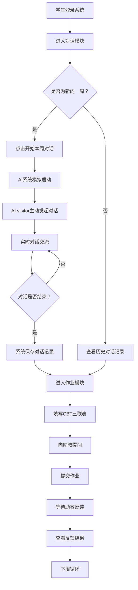
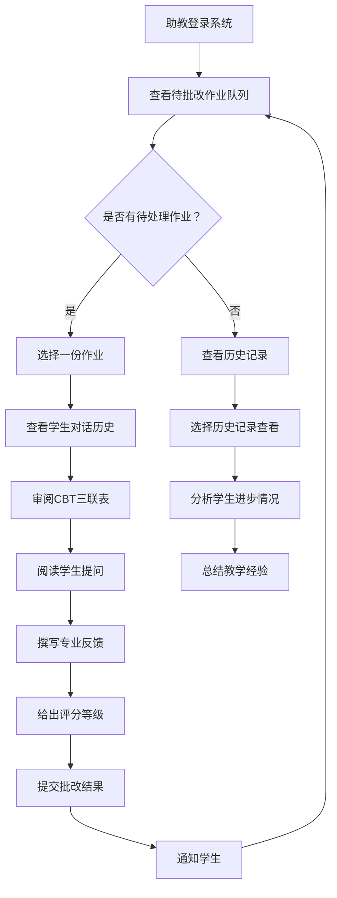
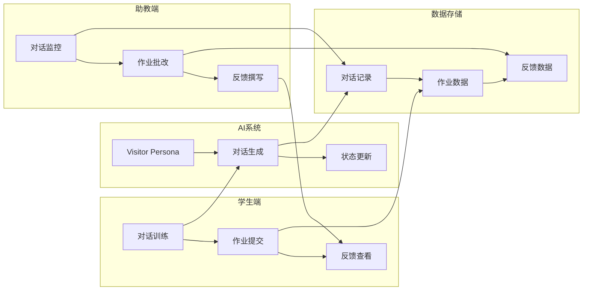

# AI认知行为疗法训练平台 产品需求文档 (PRD)

## 1. 产品概述

### 1.1 产品愿景
构建一个基于人工智能的认知行为疗法(CBT)培训平台，为心理学专业学生提供与AI模拟客户端练习咨询技能的实训环境，同时为助教提供高效的督导和评估工具。

### 1.2 产品定位
- **目标用户**: 心理学专业本科生、研究生及其助教
- **核心价值**: 通过AI技术降低CBT实训成本，提高培训效率和质量
- **应用场景**: 高等院校心理学课程的实践教学环节

### 1.3 产品原则
**奥卡姆剃刀原则**: 删繁就简，专注核心教学功能
- 每个学生每学期只与1个AI visitor对话
- 每周固定进行1次对话训练
- 助教负责1个或多个AI visitor的persona管理
- 每个助教管理约20个学生的作业批改

## 2. 用户角色定义

### 2.1 角色层级体系
```
学生 (Student) → 助教 (Assistant) → 管理员 (Admin)
权限等级: 1    →    权限等级: 2    →   权限等级: 3
```

### 2.2 角色详细描述

#### 学生 (Student)
- **身份**: 心理学专业本科生或研究生
- **学习目标**: 掌握CBT基本技能，提高咨询实践能力
- **系统权限**: 访问对话训练和作业模块
- **使用频率**: 每周1次对话 + 课后作业完成

#### 助教 (Assistant) 
- **身份**: 心理学专业高年级学生或研究生助教
- **工作职责**: AI visitor persona管理、学生作业批改、专业督导
- **系统权限**: 查看负责学生的对话记录、批改作业、提供反馈
- **工作负荷**: 管理20个左右学生，负责1-3个AI visitor

#### 管理员 (Admin)
- **身份**: 课程教师或系统管理员
- **管理职责**: 系统配置、用户管理、数据分析
- **系统权限**: 全系统访问权限
- **使用频率**: 定期维护和数据分析

## 3. 核心功能模块

### 3.1 学生功能模块

#### 3.1.1 AI咨询对话模块 (`/dashboard/conversation`)
**功能描述**: 学生与固定AI visitor进行每周一次的咨询对话训练

**核心流程**:
1. **历史对话加载**
   - 系统自动加载上周对话记录
   - 支持向上滚动查看更早的历史对话
   - 对话记录按时间顺序排列

2. **开始对话流程**
   - 学生点击"开始本周对话"按钮
   - 系统显示AI模拟运行进度条
   - 展示模拟日志: "AI visitor正在更新状态..."
   - AI visitor主动发起本周对话

3. **实时对话功能**
   - 类似微信的聊天界面
   - 支持文本消息发送和接收
   - AI visitor能够布置课后作业
   - 对话过程记录完整保存

4. **结束对话**
   - 学生或AI可以主动结束对话
   - 系统保存完整对话记录
   - 显示"对话已保存"确认信息

#### 3.1.2 作业互动模块 (`/dashboard/assignments`)
**功能描述**: 学生完成CBT作业并与助教进行专业互动

**核心功能**:
1. **对话列表展示**
   - 显示所有历史对话记录
   - 按时间远近排序（最近的在前）
   - 每条对话显示日期、主题、状态

2. **CBT三联表填写**
   - 针对每次对话填写分析表格
   - 包含字段: 情境(Situation)、想法(Thoughts)、情绪(Emotions)、行为(Behaviors)
   - 支持保存草稿和正式提交

3. **向助教提问**
   - 就具体对话内容向助教发起专业咨询
   - 提问内容与对话记录关联
   - 支持文字描述和问题分类

4. **查看反馈**
   - 查看助教对CBT分析的专业反馈
   - 浏览助教对提问的详细解答
   - 反馈历史记录和评分

### 3.2 助教功能模块

#### 3.2.1 对话历史查看 (`/dashboard/conversation-history`)
**功能描述**: 助教查看负责学生与AI visitor的完整对话记录

**核心功能**:
1. **Visitor选择**
   - 显示助教负责的所有AI visitor列表
   - 每个visitor显示基本信息和负责学生数量
   - 支持在不同visitor间快速切换

2. **学生对话浏览**
   - 查看选定visitor下所有学生的对话列表
   - 每个学生显示对话次数、最近对话时间
   - 支持按学生姓名、对话时间筛选

3. **隔离原则**
   - 相同visitor名称但不同学生的记录完全隔离（也就是每个instance对应的是user id）
   - 助教只能查看自己负责的学生记录
   - 保护学生隐私和数据安全

#### 3.2.2 待批改作业 (`/dashboard/review-assignments`)
**功能描述**: 助教处理学生提交的CBT作业和专业问题

**核心功能**:
1. **作业队列管理**
   - 显示所有待处理的学生作业
   - 按提交时间、紧急程度排序
   - 支持批量操作和状态筛选

2. **综合批改界面**
   - 左侧显示完整对话历史
   - 中间展示学生的CBT三联表分析
   - 右侧显示学生的具体提问
   - 一屏内完成所有信息查看

3. **专业反馈撰写**
   - 对CBT三联表各项给出专业指导意见
   - 回答学生的专业问题
   - 支持评分和等级评定
   - 提供标准化反馈模板

#### 3.2.3 批改历史记录 (`/dashboard/review-history`)
**功能描述**: 助教查看已完成的所有批改记录

**核心功能**:
1. **历史记录浏览**
   - 显示所有已批改作业的完整列表
   - 按批改时间、学生姓名、评分排序
   - 支持关键词搜索和时间筛选

2. **分页浏览**
   - 支持大量历史记录的分页显示
   - 每页显示适量记录，提高加载速度
   - 提供页码跳转和记录总数显示

## 4. 用户旅程流程图

### 4.1 学生周期性学习流程



### 4.2 助教督导工作流程



### 4.3 系统整体数据流



## 5. 技术架构约束

### 5.1 前端技术栈
- **框架**: Next.js 15 + React 19 + TypeScript
- **UI库**: shadcn/ui + Tailwind CSS 4
- **状态管理**: React Context + 本地状态
- **路由**: Next.js App Router

### 5.2 认证与权限
- **认证方式**: 模拟登录系统（验证码: 123456）
- **权限控制**: 基于角色的路由保护和内容渲染
- **会话管理**: 本地存储 + Context状态管理

### 5.3 数据存储约束
- **当前阶段**: 使用模拟数据和本地存储
- **数据隔离**: 不同学生、不同visitor的数据完全隔离
- **未来扩展**: 预留后端API接口设计空间

### 5.4 用户体验要求
- **响应式设计**: 支持桌面、平板、手机访问
- **中文界面**: 所有用户界面完全中文化
- **加载性能**: 关键操作3秒内完成
- **操作简化**: 减少不必要的页面跳转和复杂操作

## 6. 关键业务逻辑

### 6.1 对话频次控制
- 每个学生每学期只分配1个固定的AI visitor
- 每周只能进行1次正式对话训练
- 历史对话可以无限次回顾，但不能重复训练

### 6.2 作业关联机制
- 每次对话自动生成对应的CBT作业任务
- 作业必须基于真实对话内容进行分析
- 学生提问必须与具体对话场景关联

## 7. 与后端对齐说明（新增）

### 7.1 角色与鉴权
- 角色：student / assistant_tech / assistant_class / admin
- 登录流程：
  - POST /auth/request-code { email } → POST /auth/verify-code { email, code } → 返回 { token, role }
  - 前端持久化 token（LocalStorage），后续请求统一带 Header：Authorization: Bearer <token>
- 错误处理：
  - 401：未登录或 token 失效 → 跳转登录
  - 403：无权限或越权数据 → 显示无权限提示

### 7.2 页面与端点映射
- dashboard/conversation（学生）
  - 开始：POST /sessions/start
  - 聊天：POST /sessions/{id}/messages
  - 自动加载上一条：GET /sessions/last?visitorInstanceId=...
  - 结束：POST /sessions/{id}/finalize（携带 assignment 文本）
- dashboard/assignments（学生）
  - 汇总：GET /assignments/list?visitorInstanceId=...
  - 三联表：POST/GET /thought-records
  - 提问：POST/GET /questions
- dashboard/conversation-history（助教-技术）
  - 负责实例：GET /assistant/visitors
  - 实例学生：GET /assistant/students?visitorInstanceId=...
  - 学生会话：GET /assistant/students/{studentId}/sessions
  - 学生历史：GET /assistant/students/{studentId}/history
  - 助教反馈：POST/GET /assistant/feedback
- dashboard/class-monitor（助教-行政）
  - 本班学生：GET /assistant-class/students
  - 学生会话：GET /assistant-class/students/{studentId}/sessions
  - 周合规报告：GET /assistant-class/compliance?week=YYYY-WW（不传 week = 当前周）

### 7.3 Header 与示例
- 所有受保护请求：
```http
Authorization: Bearer <token>
Content-Type: application/json
```

### 7.4 限时规则（北京时间）
- 学生：每自然周周五 24:00 前需完成“当周会话 + 三联表”。逾期当周将被关闭“开始会话”。
  - /sessions/start 若锁定将返回 403，code=student_locked_for_week。
- 技术助教：每自然周周日 24:00 前需给当周至少一次反馈，后台周报统计未完成。

### 7.5 UI 提示与状态
- 锁定态：拦截 /sessions/start 返回 403 时，展示提示文案与引导（如查看作业页/联系助教）。
- 周报页（行政助教）：以合规 API 返回的 flags 渲染“未交/未反馈”状态与筛选。

### 7.6 Mock 与联调
- 开发阶段可使用真实后端（推荐）。若需本地 Mock：保证响应字段与 API 文档一致，时间字段使用 ISO 字符串（北京时间渲染）。
- 鉴权：推荐集成登录流程；也可在开发时从 /auth/verify-code 得到一次 token 写死到环境中，便于快速联调。